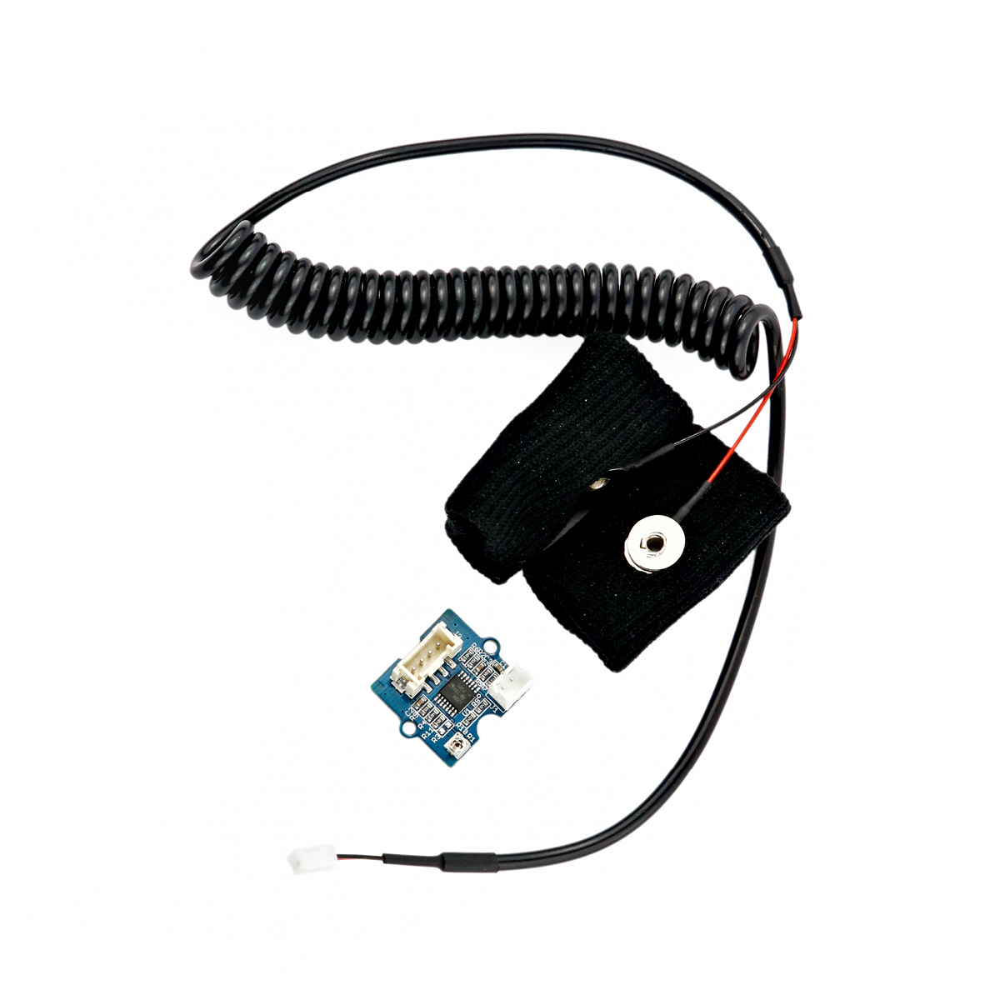

---
title: "Hautleitwertsensor"
date: "2018-10-01T14:14:11.000Z"
tags: 
  - "sensor"
coverImage: "33_hautleitwertsensor.jpg"
material_number: "33"
material_type: "sensor"
material_short_descr: "Seeed Studio Grove – GSR Sensor"
manufacture: "Seeed Studio"
manufacture_url: "https://www.seeedstudio.com/"
repo_name: "mks-SeeedStudio-Grove_GSR_Sensor_v1.2"
repo_prefix: "mks"
repo_manufacture: "SeeedStudio"
repo_part: "Grove_GSR_Sensor_v1.2"
product_url: "https://wiki.seeedstudio.com/Grove-GSR_Sensor/"
clone_url: "https://github.com/Make-Your-School/mks-SeeedStudio-Grove_GSR_Sensor_v1.2.git"
embedded_example_file: "examples/Grove_GSR_Sensor_v1.2_minimal/Grove_GSR_Sensor_v1.2_minimal.ino"
---

# Hautleitwertsensor

## Beschreibung
Der Hautleitwertsensor misst über zwei Elektroden den Leitwert der menschlichen Haut. Er stellt also fest, wie gut diese elektrisch leitet. Die Hautleitfähigkeit wird unter anderem durch die Feuchtigkeit der Haut beeinflusst, welche je nach (emotionaler) Verfasstheit des Menschen variiert und sich beispielsweise durch Stress erhöht. Die Messung des Hautleitwertes kann somit unter anderem herangezogen werden, um mit einem Lügendetektoren das Stresslevel zu messen. Der Sensor lässt sich direkt oder mithilfe des Grove Shields an einen Arduino anschließen. Die Kommunikation läuft über einen \[simple\_tooltip content='

Digital vs. analog:

- Analoge Signale können beliebige, kontinuierliche Werte annehmen. Sie verändern sich stufenlos. Dadurch können theoretisch unendlich kleine Änderungen (und damit ein unendlicher Informationsinhalt) übertragen werden. Einschränkend wirkt die Genauigkeit, mit der das analoge Signal ausgelesen/erfasst wird.
- Das digitale Signal nimmt nur diskrete Werte an und springt bei einer etwaigen Änderung von einem Wert zum nächsten. Es kann nur eine definierte Anzahl an Informationsinhalten übertragen werden. Vorteilhaft ist dagegen die damit verbundene Fehlerfreiheit bei minimalsten, ungewollten Schwankungen. Oftmals werden nur zwei Werte HIGH und LOW (Ein/Aus oder 1/0) übermittelt.

'\]analogen\[/simple\_tooltip\] \[simple\_tooltip content='Die Mikrocontroller besitzen kleine metallische Kontakte, an die Komponenten, Shields oder andere Platinen angeschlossen werden können. Diese Kontakte werden Pins genannt und können oft als sogenannte GPIO’s (Allzweck Ein- und Ausgabe) eingesetzt werden. Dies bedeutet, dass diese Pins direkt über die Programmierung des Mikrocontrollers angesprochen werden können und hierbei sogar bestimmt werden kann, ob dieser Pin ein Eingang (beispielsweise zum Auslesen eines Sensors) oder als Ausgang (beispielsweise zur Steuerung eines Motors) genutzt werden kann. Praktisches vereinfachtes Beispiel: Wird am Arduino eine LED an Pin 1 angeschlossen, kann im Programm direkt der Pin 1 als „An“ oder „Aus“ definiert werden und damit die LED an- oder ausgeschaltet werden.'\]Anschluss\[/simple\_tooltip\].

Alle weiteren Hintergrundinformationen, sowie ein Beispielaufbau und alle notwendigen Programmbibliotheken sind auf dem offiziellen Wiki (bisher nur in englischer Sprache) von Seeed Studio zusammengefasst. Zusätzlich findet man über alle gängigen Suchmaschinen durch die Eingabe der genauen Komponentenbezeichnungen entsprechende Projektbeispiele und Tutorials.

<!-- infolist -->

<!-- infolists -->
## Wichtige Links für die ersten Schritte:

- [Seeed Studio Wiki](http://wiki.seeedstudio.com/Grove-GSR_Sensor/) [- Hautleitwertsensor](http://wiki.seeedstudio.com/Grove-GSR_Sensor/)

## Projektbeispiele:

- [Hackster - Lügendetektor](https://www.hackster.io/BuildItDR/arduino-lie-detector-a0b914)

## Weiterführende Hintergrundinformationen:

- [Hautwiderstand - Wikipedia Artikel](https://de.wikipedia.org/wiki/Hautwiderstand)
- [GPIO - Wikipedia Artikel](https://de.wikipedia.org/wiki/Allzweckeingabe/-ausgabe)
- [GitHub-Repository: Hautleitwertsensor](https://github.com/MakeYourSchool/33-Hautleitwertsensor)

