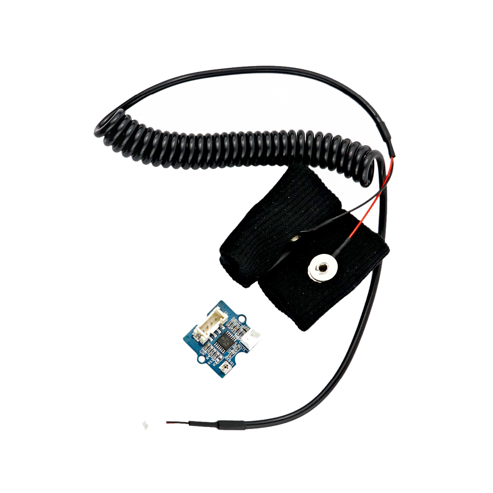

# Hautleitwertsensor

## Beschreibung
Der Hautleitwertsensor misst über zwei Elektroden den Leitwert der menschlichen Haut. Er stellt also fest, wie gut diese elektrisch leitet. Die Hautleitfähigkeit wird unter anderem durch die Feuchtigkeit der Haut beeinflusst, welche je nach (emotionaler) Verfasstheit des Menschen variiert und sich beispielsweise durch Stress erhöht. Die Messung des Hautleitwertes kann somit unter anderem herangezogen werden, um mit einem Lügendetektoren das Stresslevel zu messen. Der Sensor lässt sich direkt oder mithilfe des Grove Shields an einen Arduino anschließen. Die Kommunikation läuft über einen analogen Anschluss.

Alle weiteren Hintergrundinformationen, sowie ein Beispielaufbau und alle notwendigen Programmbibliotheken sind auf dem offiziellen Wiki (bisher nur in englischer Sprache) von Seeed Studio zusammengefasst. Zusätzlich findet man über alle gängigen Suchmaschinen durch die Eingabe der genauen Komponentenbezeichnungen entsprechende Projektbeispiele und Tutorials.

<!-- infolist -->

<!-- infolists -->
## Wichtige Links für die ersten Schritte:

- [Seeed Studio Wiki](http://wiki.seeedstudio.com/Grove-GSR_Sensor/) [- Hautleitwertsensor](http://wiki.seeedstudio.com/Grove-GSR_Sensor/)

## Projektbeispiele:

- [Hackster - Lügendetektor](https://www.hackster.io/BuildItDR/arduino-lie-detector-a0b914)

## Weiterführende Hintergrundinformationen:

- [Hautwiderstand - Wikipedia Artikel](https://de.wikipedia.org/wiki/Hautwiderstand)
- [GPIO - Wikipedia Artikel](https://de.wikipedia.org/wiki/Allzweckeingabe/-ausgabe)
- [GitHub-Repository: Hautleitwertsensor](https://github.com/MakeYourSchool/33-Hautleitwertsensor)

